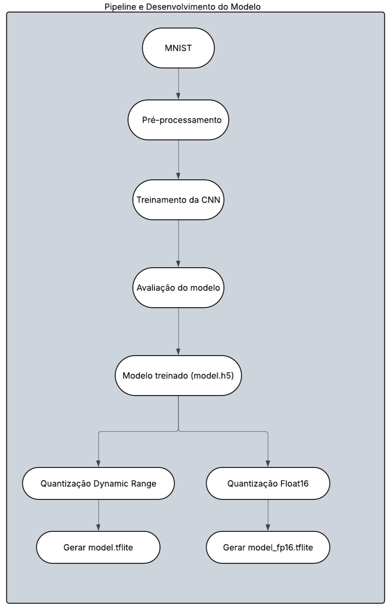
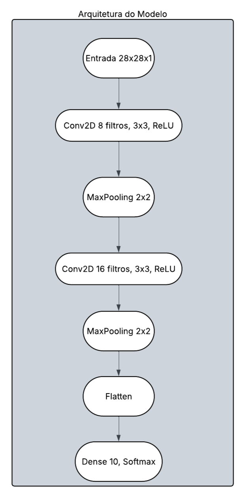

# Classificação de Dígitos com CNN e Otimização para Edge AI


## Relatório do Candidato

Identificação:

| Nome                         | GitHub           |
| ---------------------------- | ---------------- |
| Leôncio Ferreira Flores Neto | [@LeoncioFerreira](https://github.com/LeoncioFerreira)|

## Navegação Rápida

- [Objetivo do Projeto](#1-objetivo-do-projeto)
- [Como Executar](#2-como-executar)
- [Estrutura do Projeto](#3-estrutura-do-projeto)
- [Arquitetura do Modelo](#4-arquitetura-do-modelo)
- [Bibliotecas Utilizadas](#5-bibliotecas-utilizadas)
- [Reprodutibilidade e Seed](#6-reprodutibilidade-e-seed)
- [Treinamento e Hiperparâmetros](#7-treinamento-e-hiperparâmetros)
- [Métricas e Evidência de Resultado](#8-métricas-e-evidência-de-resultado)
- [Salvamento do Modelo Treinado](#9-salvamento-do-modelo-treinado)
- [Conversão e Otimização para TFLite](#10-conversão-e-otimização-para-tflite)
- [Comparação dos Artefatos](#11-comparação-dos-artefatos)
- [Trade-offs e Conclusões](#12-trade-offs-e-conclusões)

## 1. Objetivo do Projeto

Este projeto implementa um pipeline completo de Visão Computacional para classificação de dígitos manuscritos do dataset MNIST, seguindo o fluxo:

`treinamento -> salvamento -> conversão -> otimização`

O foco da solução não foi apenas obter boa acurácia, mas também manter a arquitetura simples, leve e adequada para cenários de Edge AI, com baixo custo computacional e facilidade de implantação em dispositivos com restrições de memória e processamento.

## 2. Como Executar

```bash
pip install -r requirements.txt
python train_model.py
python optimize_model.py
```

## 3. Estrutura do Projeto

```text
.
├── train_model.py              # Treinamento da CNN com dataset MNIST
├── optimize_model.py           # Conversão e otimização do modelo para TFLite
├── requirements.txt            # Dependências necessárias para execução
├── model.h5                    # Modelo treinado salvo em formato Keras
├── model.tflite                # Modelo convertido com Dynamic Range Quantization
├── model_fp16.tflite           # Modelo convertido em Float16 para comparação
├── README.md                   # Relatório técnico do projeto
└── docs/
    ├── Arquitetura-do-modelo.png              # Diagrama da arquitetura da CNN
    └── Pipeline-e-Desenvolvimento-do-Modelo.png # Diagrama do fluxo do projeto
```

Os arquivos principais foram organizados para refletir diretamente as etapas do projeto: treinamento, geração do modelo salvo, conversão para TensorFlow Lite, documentação técnica e diagramas de apoio.

## 4. Arquitetura do Modelo

O modelo implementado em `train_model.py` é uma CNN simples para classificação de dígitos manuscritos. A entrada tem formato `28x28x1` e o fluxo da rede é:

- `Conv2D(8, kernel_size=3, activation="relu")`
- `MaxPooling2D(pool_size=2)`
- `Conv2D(16, kernel_size=3, activation="relu")`
- `MaxPooling2D(pool_size=2)`
- `Flatten()`
- `Dense(10, activation="softmax")`

Essa arquitetura foi escolhida por ser suficiente para o MNIST e, ao mesmo tempo, enxuta o bastante para manter baixo número de parâmetros, treinamento rápido em CPU e boa compatibilidade com conversão para TensorFlow Lite.

### Decisão arquitetural

O modelo conecta o `Flatten` diretamente a `Dense(10)`, sem camadas densas intermediárias. Essa decisão foi tomada porque, para um problema simples como o MNIST, adicionar mais camadas densas aumentaria o custo computacional e o tamanho do modelo sem ganho relevante de desempenho.

Assim, a arquitetura final favorece:

- simplicidade de implementação;
- eficiência em CPU;
- menor tamanho de artefato;
- melhor adequação a Edge AI.

Em termos de engenharia, isso representa um trade-off intencional: abrir mão de complexidade desnecessária para preservar eficiência, reprodutibilidade e facilidade de implantação.

Diagrama do pipeline do projeto:

<p align="center">
  
</p>

Diagrama da arquitetura da CNN:

<p align="center">
  
</p>

## 5. Bibliotecas Utilizadas

As principais bibliotecas utilizadas no projeto foram:

- `tensorflow >= 2.12`
- `numpy`

Também foram utilizados módulos nativos do Python:

- `os`
- `random`

## 6. Reprodutibilidade e Seed

Para reduzir variação entre execuções e tornar o experimento mais confiável em ambientes automatizados, o projeto define `SEED = 42` e aplica a configuração em:

- `random.seed(SEED)`
- `numpy.random.seed(SEED)`
- `tf.random.set_seed(SEED)`
- `PYTHONHASHSEED`

Essa decisão melhora a consistência dos resultados e fortalece a confiabilidade da solução em execuções locais e em CI.

## 7. Treinamento e Hiperparâmetros

O treinamento é realizado no arquivo `train_model.py` com os seguintes parâmetros principais:

- `epochs = 5`
- `batch_size = 128`
- otimizador `adam`
- função de perda `sparse_categorical_crossentropy`
- métrica `accuracy`

O número de épocas foi mantido baixo para respeitar o contexto de CPU e CI, reduzindo tempo de execução sem comprometer a qualidade final no MNIST.

## 8. Métricas e Evidência de Resultado

Ao final do treinamento, o modelo é avaliado no conjunto de teste e imprime as métricas `test_loss` e `test_accuracy`.

Na execução final do projeto, os resultados obtidos foram:

| Métrica | Valor |
| --- | ---: |
| `test_loss` | `0.0616` |
| `test_accuracy` | `0.9798` |

Os resultados mostram que a CNN proposta manteve desempenho alto mesmo com uma arquitetura simples. A acurácia final de `97,98%` confirma que a simplificação arquitetural não comprometeu a capacidade de classificação para o problema proposto.

## 9. Salvamento do Modelo Treinado

Após o treinamento, o modelo é salvo no formato Keras em:

- `model.h5`

Esse artefato funciona como modelo-base treinado e é utilizado posteriormente no processo de conversão para TensorFlow Lite.

## 10. Conversão e Otimização para TFLite

No arquivo `optimize_model.py`, o modelo treinado é carregado e convertido para TensorFlow Lite com foco em Edge AI.

### Técnica principal

A técnica principal utilizada foi **Dynamic Range Quantization**, aplicada durante a conversão para gerar:

- `model.tflite`

Essa abordagem reduz o tamanho do modelo ao quantizar os pesos, sem necessidade de re-treinamento, sendo adequada para cenários com restrição de memória e armazenamento.

### Técnica adicional

Opcionalmente, o projeto também gera uma versão em **Float16** para análise comparativa:

- `model_fp16.tflite`

Essa versão foi mantida para comparação entre estratégias de otimização e análise de trade-offs entre compactação e preservação numérica.

## 11. Comparação dos Artefatos

| Artefato | Estratégia | Tamanho | Redução vs. `model.h5` | Benefício principal |
| --- | --- | ---: | ---: | --- |
| `model.h5` | Modelo original Keras | 98.520 bytes | - | Versão-base treinada para conversão e comparação |
| `model.tflite` | Dynamic Range Quantization | 9.936 bytes | **89,9%** | Melhor compactação para Edge AI |
| `model_fp16.tflite` | Float16 | 15.536 bytes | **84,2%** | Alternativa para benchmark e comparação |

Os resultados indicam que `model.tflite` foi a melhor opção para implantação em dispositivos embarcados com recursos limitados, pois alcançou a maior redução de tamanho. Já `model_fp16.tflite` oferece uma alternativa útil para comparação técnica.

## 12. Trade-offs e Conclusões

O projeto foi equilibrado em três frentes principais:

- **desempenho**: `97,98%` de acurácia no conjunto de teste;
- **simplicidade**: arquitetura pequena, clara e adequada ao MNIST;
- **eficiência de implantação**: redução de até `89,9%` no tamanho do modelo final.

As principais decisões técnicas foram:

- limitar a arquitetura a duas camadas convolucionais;
- evitar camadas densas intermediárias desnecessárias;
- controlar `seed` para melhorar reprodutibilidade;
- aplicar otimização focada em viabilidade para Edge AI.

Como limitação, trata-se de uma solução pensada para um problema simples e para execução com restrições de CPU e CI. Em problemas mais complexos, arquiteturas mais profundas poderiam melhorar desempenho, mas com maior custo computacional e maior tamanho de modelo.

No contexto deste desafio, a solução atingiu um bom equilíbrio entre precisão, simplicidade e eficiência, atendendo ao objetivo de desenvolver um modelo funcional e apropriado para Edge AI.
